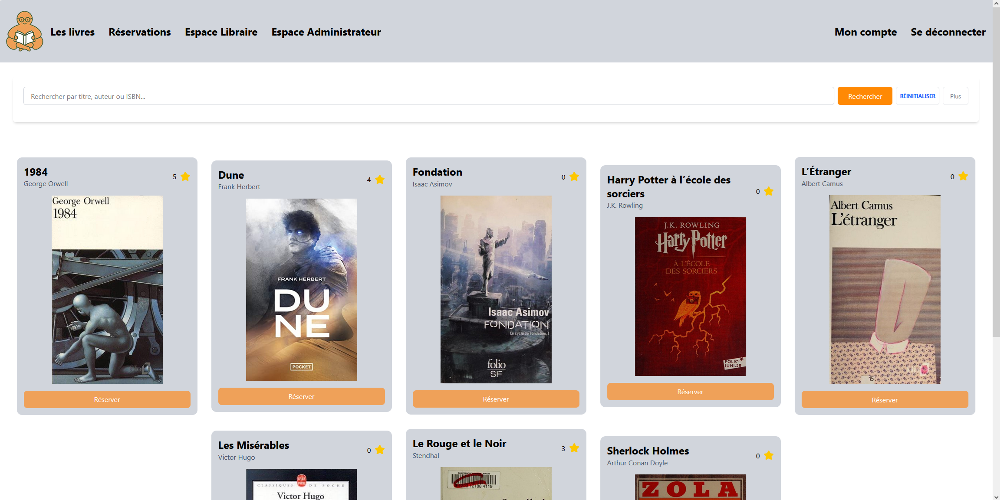
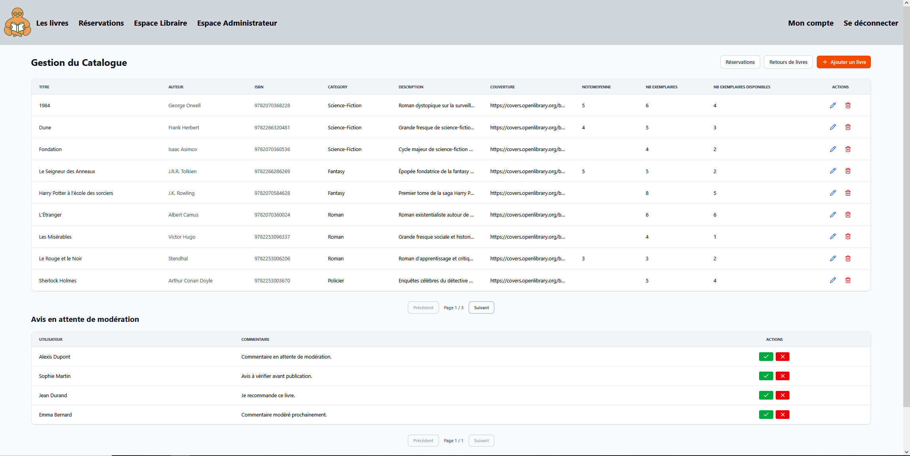
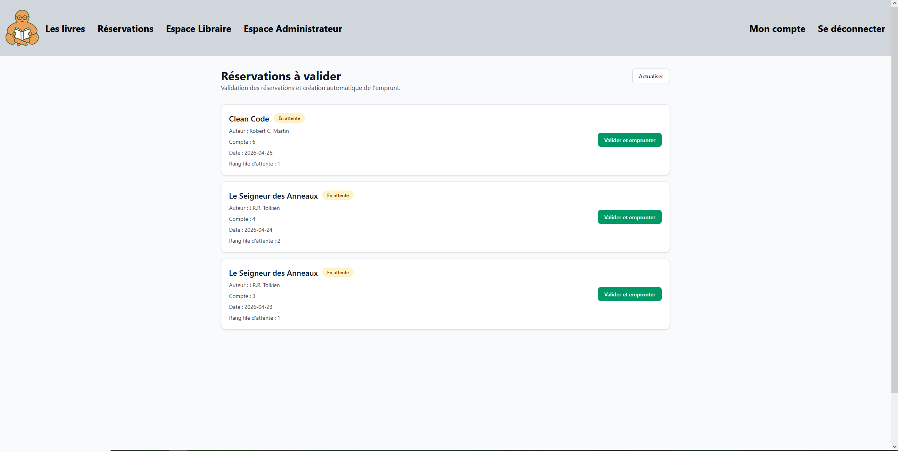

# BookHub

[](https://spring.io/)
[](https://angular.io/)
[](https://www.oracle.com/java/)
[](https://gradle.org/)

**BookHub** est une plateforme web de gestion de bibliothèque communautaire développée pour l'association **"Quartier Solidaire"**. 

Ce projet a été conçu dans le cadre du cursus *Concepteur Développeur d'Applications* de l'**ENI**. L'objectif principal est de moderniser un système de gestion papier obsolète pour améliorer l'efficacité opérationnelle et l'expérience des adhérents.

---

## Vitrine (Captures d'écran)

| Accueil Utilisateur | Espace Libraire | Réservations |
| :---: | :---: | :---: |
|  |  |  |

---

## Fiche Technique

L'application repose sur une **Architecture 3-Tiers** (Modèle-Vue-Contrôleur) assurant une séparation stricte des responsabilités :

* **Frontend :** Angular (Interface utilisateur dynamique et réactive)
* **Backend :** Spring Boot (API RESTful robuste)
* **Gestionnaire de dépendances :** Gradle
* **Version Java :** JDK 21

---

## Fonctionnalités Majeures

- **Gestion des Emprunts** : Suivi complet du cycle de vie d'un livre (disponible, emprunté, retourné).
-  **Réservations** : Possibilité pour les adhérents de réserver des ouvrages en ligne.
-  **Système d'Avis** : Modules de notations et de commentaires sur les livres lus.
-  **Espace Libraire** : Gestion du catalogue (CRUD livres, auteurs, catégories).
-  **Administration** : Gestion des utilisateurs et modération des contenus (commentaires).

---

## Guide de Démarrage Rapide

### Prérequis
* **Java 21** ou supérieur
* **Node.js** (dernière version LTS)
* **Angular CLI** (`npm install -g @angular/cli`)
* **Gradle** (inclus via le wrapper)

### Installation et Lancement

1. **Clonage du projet**
   ```bash
   git clone https://github.com/KKMYA/bookhub.git
   cd bookhub

2. **Lancer le Backend (Spring Boot)**
    ```bash
    ./gradlew bootRun

3. **Configuration Frontend**
     ```bash
    cd frontend
    npm install
    ng serve

**L'application est accessible sur http://localhost:4200.**

## Guide d'Utilisation

1. **Connexion :** Identifiez-vous pour accéder à votre espace personnel.
2. **Consultation :** Parcourez le catalogue et consultez les avis des autres membres.
3. **Réservation :** Réservez votre prochain livre en un clic.
4. **Gestion :** Les libraires valident les emprunts et retours physiquement via leur tableau de bord dédié.


## Auteurs
- [Mélanie ROY](https://www.linkedin.com/in/m%C3%A9lanie-roy/)
- [Agnès GUILLET](https://www.linkedin.com/in/agnesguillet/)
- [Alexis CALLET](https://www.linkedin.com/in/alexiscallet/)
- [Alexandre RENARD](https://www.linkedin.com/in/alexandre-renard-07b7b2317/)
